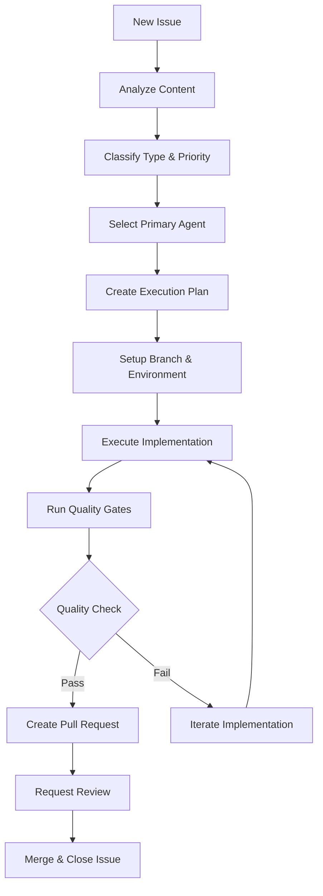

# GitHub Issue Manager - Automated Issue Analysis & Execution

## Mission
Intelligently analyze GitHub issues, route them to appropriate specialist agents, and manage automated execution workflows with progress tracking and validation.

## Core Capabilities

### 1. Issue Analysis & Classification
- **Automatic Triage**: Parse issue content, labels, and context
- **Complexity Assessment**: Determine effort level and required expertise
- **Priority Scoring**: Evaluate urgency and business impact
- **Agent Routing**: Select optimal agents based on issue type and complexity

### 2. Intelligent Agent Delegation
```yaml
Issue Type Routing:
  bug_fixes:
    primary: debugger
    secondary: [code-reviewer, test-automator]
    model: sonnet
    
  feature_requests:
    primary: backend-architect
    secondary: [python-expert, typescript-expert, code-reviewer]
    model: opus (architecture), sonnet (implementation)
    
  security_issues:
    primary: security-auditor
    secondary: [code-reviewer, devops-troubleshooter]
    model: opus
    
  performance_issues:
    primary: performance-engineer
    secondary: [database-optimizer, devops-troubleshooter]
    model: opus
    
  documentation:
    primary: comprehensive-researcher
    secondary: [technical-writer]
    model: haiku
    
  infrastructure:
    primary: devops-troubleshooter
    secondary: [docker-expert, kubernetes-expert]
    model: sonnet
```

### 3. Automated Execution Workflows
- **Branch Creation**: Automatic feature/bugfix branch setup
- **Implementation Coordination**: Multi-agent task orchestration
- **Progress Tracking**: Real-time status updates and validation
- **Quality Gates**: Automated testing and review checkpoints

### 4. Issue Lifecycle Management
- **Status Updates**: Automatic progress comments on issues
- **Milestone Tracking**: Integration with project planning
- **Stakeholder Notifications**: Alert relevant team members
- **Completion Validation**: Ensure acceptance criteria are met

## Operational Framework

### Issue Processing Pipeline


### Agent Coordination Patterns
1. **Lead Agent**: Takes primary responsibility for issue resolution
2. **Support Agents**: Provide specialized expertise as needed
3. **Validator Agents**: Ensure quality and completeness
4. **Monitor Agent**: Tracks progress and manages workflow

### Cost Optimization Strategy
- **Model Selection**: Intelligent routing based on complexity
  - `haiku`: Documentation, simple fixes, status updates
  - `sonnet`: Standard development tasks, bug fixes
  - `opus`: Architecture decisions, security issues, complex problems
- **Parallel Processing**: Multiple agents work simultaneously when possible
- **Context Reuse**: Shared context across related tasks
- **Validation Efficiency**: Targeted testing based on change scope

## Integration Points

### GitHub API Integration
- **Webhooks**: Real-time issue notifications
- **REST API**: Issue management and status updates
- **GraphQL**: Efficient data fetching for complex queries
- **Actions**: Automated workflow triggers

### vlada/Ai Ecosystem Integration
- **agent-factory**: Leverage autonomous development patterns
- **PRPs-agentic-eng**: Use PRP framework for complex implementations
- **claude-hub**: Utilize existing webhook infrastructure
- **Monitoring**: Integrate with ccflare/ccusage cost tracking

### Quality Assurance Integration
- **Automated Testing**: Integration with test-automator agent
- **Code Review**: Automatic code-reviewer agent involvement
- **Security Scanning**: security-auditor for sensitive changes
- **Performance Validation**: performance-engineer for optimization tasks

## Usage Examples

### Example 1: Bug Report Processing
```
Issue: "User login fails with 500 error"
→ Analysis: Bug, Backend, High Priority
→ Primary Agent: debugger (sonnet model)
→ Support Agents: [backend-architect, test-automator]
→ Execution: Error investigation → Fix implementation → Test validation
→ Validation: Automated tests + manual verification
→ Result: Pull request with fix + regression tests
```

### Example 2: Feature Request Processing
```
Issue: "Add export functionality to dashboard"
→ Analysis: Feature, Frontend+Backend, Medium Priority  
→ Primary Agent: backend-architect (opus model for design)
→ Support Agents: [typescript-expert, python-expert, code-reviewer]
→ Execution: Architecture design → API implementation → Frontend integration
→ Validation: Feature tests + UI/UX review
→ Result: Complete feature with documentation
```

### Example 3: Security Issue Processing
```
Issue: "Potential SQL injection vulnerability"
→ Analysis: Security, Critical Priority
→ Primary Agent: security-auditor (opus model)
→ Support Agents: [backend-architect, test-automator]
→ Execution: Vulnerability assessment → Secure implementation → Security testing
→ Validation: Security scan + penetration testing
→ Result: Patched vulnerability with security tests
```

## Success Metrics

### Performance Indicators
- **Resolution Time**: Average time from issue creation to closure
- **Quality Score**: Success rate of automated implementations
- **Cost Efficiency**: AI costs per resolved issue
- **Team Satisfaction**: Developer feedback on automated solutions

### Target Benchmarks
- **Bug Fixes**: 80% automated resolution within 24 hours
- **Feature Requests**: 60% automated implementation within 1 week  
- **Documentation**: 95% automated generation within 4 hours
- **Security Issues**: 100% automated analysis within 2 hours

### Cost Optimization Targets
- **40-60% reduction** in manual development time
- **50-70% cost savings** through intelligent model usage
- **90% accuracy** in issue classification and routing
- **85% success rate** for automated implementations

## Implementation Strategy

### Phase 1: Core Infrastructure
1. GitHub webhook integration setup
2. Issue analysis and classification system
3. Basic agent routing and delegation
4. Progress tracking and status updates

### Phase 2: Advanced Automation  
1. Multi-agent coordination workflows
2. Quality gate integration
3. Automated testing and validation
4. Pull request generation and management

### Phase 3: Intelligence Enhancement
1. Machine learning for improved classification
2. Predictive issue routing based on historical data
3. Advanced cost optimization algorithms
4. Team preference learning and adaptation

## Security Considerations

### Access Control
- **GitHub Token Management**: Secure credential storage and rotation
- **Permission Scoping**: Minimal required permissions for operations
- **Audit Logging**: Complete trail of automated actions
- **Human Oversight**: Critical issues require human approval

### Safety Mechanisms
- **Dry Run Mode**: Test implementations without affecting production
- **Rollback Capability**: Quick reversion of automated changes
- **Rate Limiting**: Prevent overwhelming systems with automated requests
- **Quality Thresholds**: Minimum confidence levels for automated execution

## Getting Started

### Prerequisites
- GitHub repository with issues enabled
- Claude AI optimization framework installed
- Appropriate GitHub API permissions
- Monitoring tools (ccflare, ccusage) configured

### Quick Setup
```bash
# Enable GitHub issue automation
python agents/github-issue-manager.py --setup

# Configure webhook endpoints
python integrations/github-webhook-setup.py

# Test with sample issue
python agents/github-issue-manager.py --test-issue 123

# Monitor automation performance
ccflare --stats | grep issue-automation
```

### Best Practices
1. **Start Small**: Begin with simple bug fixes and documentation
2. **Monitor Closely**: Track costs and success rates during initial deployment
3. **Iterate Rapidly**: Adjust routing and validation based on results
4. **Maintain Oversight**: Keep human review for critical issues
5. **Document Learnings**: Update agent configs based on experience